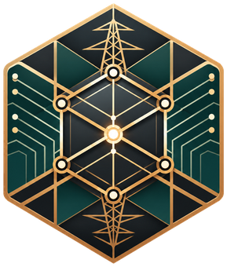

<div align="center">



</div>

<p align="center" style="font-size: 25px;">
    <b>RestoreBench</b>
</p>

<p align="center">
  
  
  
  
  
  
</p>

---

# RestoreBench

> **PowerAgentBench — Steady-State Level 3.** RestoreBench is distributed here as
> `benchmarks/steady/level_3/` of PowerAgentBench. It is self-contained: it ships its own
> Python package, frozen datasets, and `uv` lockfile, and all commands below are run from
> this directory. The original standalone repository is
> <https://github.com/Mansutti081/RestoreBench>.

**RestoreBench** is a benchmark for **restoring AC power-flow convergence with LLM agents**.

Every scenario is a power-grid snapshot for which the AC power flow does not converge under the benchmark solver settings. The agent interprets the grid model and sequentially proposes reactive-control maneuvers, receiving solver-grounded feedback after each action. The episode is successful if AC convergence is restored and the resulting state satisfies all feasibility constraints within 10 maneuvers.

```text
non-convergent snapshot
  → solver-grounded Q–V diagnostics
  → agent-selected atomic maneuver
  → isolated pandapower verification
  → next state, or terminal result
```

pandapower owns every electrical result and the success verdict. The agent interprets evidence and
chooses maneuvers; it never decides whether it won.

Non-convergence is the numerical face of voltage instability: restoring a solvable operating point
with a handful of reactive controls is a real operator task, and it makes a sharp testbed for LLM
agents — every proposed action is checked by a physics solver, so ungrounded reasoning has nowhere
to hide.

## Benchmark guarantees

* **Solvable scenarios.** Every scenario includes a deterministic witness maneuver sequence that restores AC power-flow convergence within the allowed action space and budget.
* **Solver-grounded evaluation.** Success is determined exclusively by the solver, under fixed settings and feasibility constraints. A converged state that violates generator-P/Q or external-grid limits, or that leaves part of the network de-energized, is not considered successful. Bus-voltage limits are deliberately excluded from the verdict and reported separately as solution quality.
* **Fixed interaction budget.** Each episode allows at most 10 maneuvers. Invalid, malformed, or inapplicable actions consume one maneuver without modifying the network state.
* **Consistent evaluation across grids.** All scenarios use the same action space, solver policy, feasibility criteria, and evaluation protocol.
* **Frozen and verified datasets.** Dataset artifacts are versioned and checked against their manifests, while scenarios and witnesses can be independently replayed with `restorebench-verify`.
* **Versioned results.** Each result records the dataset, solver, action-policy, ranking-policy, and result-schema versions used to produce it. Incompatible results cannot be aggregated.
* **Model-independent scoring.** Maneuver sequences can be generated by any model or agent scaffold and evaluated independently with the standalone scorer.
* **Reference agent configurations.** The repository includes chatbot, single-agent, and multi-agent configurations to compare the effect of tool access and agent architecture.

## The task

**Input.** Scenario Card of a non-convergent snapshot: topology, network state, operating limits and available actions 

**Action space.** Three atomic maneuvers, one per step:


| Action | Effect |
|---|---|
| `GEN_V_SETPOINT` | move a generator's voltage setpoint |
| `SHUNT_STEP` | switch a shunt between step 0 and 1 |
| `TAP_ADJUSTMENT` | move a transformer tap by ±1 |

Active-power redispatch, topology switching, load control, and component insertion are out of scope:
the benchmark isolates reactive control.

**Success.** AC convergence under locked solver settings (`init="dc"`, `max_iteration=30`) within a
budget of ten maneuvers, in a state that also satisfies the declared non-voltage feasibility
constraints — generator P/Q limits, external-grid P/Q bounds, and connectivity. Bus-voltage quality
is measured and reported separately, never folded into the verdict.

## Datasets

Two frozen corpora ship with the repository, under `dataset/`:

| | `ieee118` | `pegase89` |
|---|---|---|
| base network | IEEE 118-bus | PEGASE 89-bus |
| version | `ieee118-reactive-deficit-v1` | `pegase89-reactive-deficit-v1` |
| scenarios | 46 | 46 |
| scenario class | `REACTIVE_DEFICIT` | `REACTIVE_DEFICIT` |

Every shipped scenario is an evaluation scenario. Both corpora were curated out of much larger
generated pools; selection is grouped by leakage group, so no two shipped scenarios share a
generation recipe with each other's provenance.

Each corpus is laid out the same way:

```text
dataset/<grid>/
    <GRID>_BASE_CASE.json       the unmodified network
    <GRID>_AUGMENTED.json       the healthy augmented network the corpus was built from
    full/S####.json             the scenario snapshot, ground truth for scoring
    lean/S####.json             the reduced snapshot handed to the runtime
    llm/S####.md                the Scenario Card the agent reads
    private/labels.json         curation labels: regime, witness length, boundary evidence
    private/witnesses.json      a known resolving maneuver sequence per scenario
    manifest.json               artifact hashes and policy versions
    evaluation_manifest.json    the scenario roster the loader validates against
```

> [!WARNING]
> `private/` contains benchmark ground truth, including the witness solutions. Never expose it to the evaluated agent.


## Installation

Python 3.11, with a [`uv`](https://docs.astral.sh/uv/) lockfile pinning every transitive dependency.

1. ⭐ Star the [original repository](https://github.com/Mansutti081/RestoreBench) on GitHub to support the project!

2. Clone PowerAgentBench and sync from this benchmark's directory:

    ```bash
    git clone https://github.com/Power-Agent/PowerAgentBench.git
    cd PowerAgentBench/benchmarks/steady/level_3
    uv sync                   # installs the package and its console entry points
    ```

3. Check the install:

    ```bash
    uv run pytest -q                  # full suite, ~15 min
    uv run pytest -q -m "not slow"    # skips the full-corpus checks, ~8 min
    ```

## Getting Started

### Option 1: score maneuvers from any model

The scorer is standalone. Produce a maneuver sequence however you like — any model, any scaffold —
write it to JSON, and the scorer replays it against the frozen snapshot:

```json
{
  "scenario_id": "S0008",
  "maneuvers": [
    {"type": "GEN_V_SETPOINT", "gen_id": 33, "new_vm_pu": 0.96}
  ]
}
```

```bash
uv run restorebench-score attempt.json
uv run restorebench-score --batch attempts/ --out results/my_run
```

The report gives the status (`SUCCESS` / `BUDGET_EXHAUSTED`), the per-step outcome of every
maneuver, the number of invalid actions, and the quality of the terminal state. A batch report
additionally aggregates success rate and maneuver counts, broken down by dataset split.

To sanity-check the setup, score a scenario's own witness from `private/witnesses.json` — it must
come back `SUCCESS`.

### Option 2: run the bundled agent harness

Three configurations are included, differing in whether the agent has physics tools and in how the
work is split across roles:

| # | Configuration | Physics tools |
|---:|---|---|
| 1 | general chatbot | no |
| 2 | single agent | yes |
| 3 | analyst + executor + orchestrator | yes |

The exact prompts used in the experiments ship with the implementation: system and user templates
per configuration in `restorebench/agents/` (`baseline_chatbot.py`, `single_agent.py`,
`analyst.py`, `executor.py`), the shared fragments — action vocabulary, cause taxonomy,
composition rules — in `restorebench/agents/prompt_fragments.py`, the tool descriptions and
schemas in `restorebench/agents/tool_loop.py`, and the runtime substitutions (Scenario Card,
diagnostics, maneuver history, failure feedback) in their renderers under
`restorebench/environment/` and `restorebench/agents/history_render.py`.

**To re-run a published experiment**, use the campaign that defines it. Everything the sweep needs
— the exact scenarios, models, configurations, repetitions and wall-clock limit — is frozen in
[`restorebench/sweeps/campaigns.json`](restorebench/sweeps/campaigns.json), so a provider credential
is the only thing you have to supply:

```bash
uv run restorebench-sweep --campaign ieee118-anthropic --dry-run   # print the queue, spend nothing
uv run restorebench-sweep --campaign ieee118-anthropic             # 46 scenarios × 9 cells
uv run restorebench-sweep --campaign ieee118-bedrock
uv run restorebench-sweep --campaign ieee118-openai
uv run restorebench-sweep --campaign pegase89-anthropic
uv run restorebench-sweep --campaign pegase89-bedrock
uv run restorebench-sweep --campaign pegase89-openai
```

| Campaign | Corpus | Models | Cells |
|---|---|---|---:|
| `ieee118-anthropic` | IEEE 118, all 46 | Haiku 4.5, Sonnet 5, Opus 5 | 414 |
| `ieee118-bedrock` | the same 46 scenarios | DeepSeek V3.2, Kimi K2.5, GLM-5 | 414 |
| `ieee118-openai` | the same 46 scenarios | GPT-5.6 Sol | 138 |
| `pegase89-anthropic` | PEGASE 89, all 46 | Haiku 4.5, Sonnet 5, Opus 5 | 414 |
| `pegase89-bedrock` | the same 46 scenarios | DeepSeek V3.2, Kimi K2.5, GLM-5 | 414 |
| `pegase89-openai` | the same 46 scenarios | GPT-5.6 Sol | 138 |

The sweep is resumable and writes one scenario at a time, so an interrupted run leaves whole cases
rather than half-measured ones. It waits out provider outages instead of recording them as model
failures, and stops rather than burning the queue on a dead credential. Re-running it skips cells
that are already stored, and prints running spend so you can stop when you have seen enough.

For a one-off run outside a published campaign, drive the harness directly:

```bash
uv run restorebench-eval \
    --model claude-opus-5 \
    --configuration 2 --configuration 3 \
    --data-dir dataset/ieee118 \
    --results-dir results/my_sweep \
    --repeats 5
```

Results are written one JSON per cell (scenario × configuration × model × repetition).

### Option 3: generate your own corpus

```bash
uv run restorebench-generate --network case118 --n 200 --output-dir data/staging/my-corpus
uv run restorebench-validate --dataset-dir data/staging/my-corpus
```

`--network` accepts `case118` and `case89pegase`. Generation is long and crash-resumable: pass
`--checkpoint-root` and `--resume` to pick an interrupted run back up where it stopped.

## Analysing results

Turning a result store into plot-ready tables is two steps, both of which read only stored results:

```bash
uv run python -m restorebench.sweeps.build_figure_dataset
uv run python -m restorebench.sweeps.build_figure_tables
```

They write to `reports/`. **No result cells ship with this repository** — every number these
builders produce is one you measured yourself. The published aggregate figures are reproduced in
the [Results](#results) section below and can be rebuilt from any result store with
`restorebench-figures`.

### Rebuilding the paper figures

All seven paper figures are rebuilt from any result store with a single command:

```bash
uv sync --group plots
uv run restorebench-figures --store results/ieee118-bedrock --store results/ieee118-anthropic
```

| Figure | What it shows | Computed from |
|---|---|---|
| `figure_success_rate` | success rate per model and architecture | the stored episode statuses |
| `figure_cost_vs_success` | average cost per case against success rate | stored token counts priced through the model registry |
| `figure_voltage_band` | how much of the network the restored state keeps inside the voltage band | per-SUCCESS quality results over the corpus bus count |
| `figure_failure_composition` | how BUDGET_EXHAUSTED episodes spend their ten slots, per architecture | the per-slot failure feedback: still diverged, structured-output failure, invalid action, solved infeasible |
| `figure_maneuver_progress` | whether committed maneuvers improved, left unchanged, or worsened the distance from solvability, split by architecture and terminal outcome | the overstress chain: baseline diagnostics from the trace, then each maneuver's post-solve diagnostics; converged states count as zero distance |
| `figure_timeout_maneuvers_remaining` | how many of the ten slots were still unused when TIMEOUT episodes were cut | budget minus the slot-consuming feedback events |
| `figure_timeout_llm_calls_per_maneuver` | LLM interaction efficiency before timeout | trace LLM-call counts over committed maneuvers, binned |

Every percentage is computed from the stored cells at build time — nothing is hand-entered — and
the computed tables are printed next to the rendered PDFs, so each figure is auditable against the
store it came from. Episodes whose feedback chain cannot be attributed unambiguously are excluded
and reported, never guessed; pooling stores with different corpus or policy version stamps is
refused. Figures with no qualifying episodes are skipped with a message rather than rendered
empty.

### LLM credentials

Live provider calls dispatch on model id to one of three transports, all credentialed from the
environment and never from code:

| Transport | Models | Credential |
|---|---|---|
| Anthropic Messages API | Opus 5, Sonnet 5, Haiku 4.5 | `ANTHROPIC_API_KEY` |
| OpenAI Responses API | GPT-5.6 Sol | `OPENAI_API_KEY` |
| Bedrock Converse (`us-east-1`) | DeepSeek V3.2, Kimi K2.5, GLM-5 | `AWS_BEARER_TOKEN_BEDROCK` |

The GPT-5.6 Sol experiments are frozen as the `ieee118-openai` and `pegase89-openai` campaigns;
the transport, tool-call translation and reasoning settings are handled by the model registry:

```bash
export OPENAI_API_KEY=sk-...
uv run restorebench-sweep --campaign ieee118-openai
uv run restorebench-sweep --campaign pegase89-openai
```

Adding a further OpenAI model is a registry edit in `restorebench/llm/models.py` (id, slug,
price) plus, if the model supports it, a reasoning entry in
`restorebench/llm/openai_provider.py`.

The test suite mocks every provider client and needs no network access. Tests that do call a live
provider are opt-in behind `RESTOREBENCH_LLM_INTEGRATION=1`.

## Repository layout

```text
restorebench/
    agents/         the agent configurations: prompt templates, tool loops, reprompts
    environment/    resolution runner, scenario loader, Scenario Card rendering
    physics/        feasibility evaluation, action semantics, ranking policy
    tools/          power flow, sandbox, topology — the agent-facing tools
    llm/            provider transports and the model registry
    schemas/        the pydantic contracts every layer validates against
    eval/           the evaluation harness and its result store
    scoring/        the standalone scorer and the one-shot runner
    sweeps/         sweep runners and report builders
    analysis/       result aggregation, stratified metrics, bootstrap CIs
    corpus/         corpus generation pipeline
dataset/            the two frozen corpora
tests/              mirrors the package, one directory per subpackage
```

`results/` and `reports/` are run outputs and are not versioned. Seven console entry points are
installed with the package:

| Command | What it does |
|---|---|
| `restorebench-score` | score a maneuver attempt against a frozen scenario |
| `restorebench-eval` | run an evaluation sweep |
| `restorebench-sweep` | run a published campaign end to end, resumable |
| `restorebench-verify` | replay every witness to verify a corpus, no LLM calls |
| `restorebench-generate` | generate a new corpus into a staging directory |
| `restorebench-validate` | validate a corpus from scratch, independently of the generator |
| `restorebench-figures` | rebuild the paper figures from a result store |


## Reproducibility

Every published experiment is re-runnable from a clean clone with nothing but a provider
credential: `restorebench/sweeps/campaigns.json` freezes the scenario list, the model suite, the
configurations, the repetitions and the wall-clock limit, and `restorebench-sweep` runs them.

The corpus itself can be checked without any credential at all:

```bash
uv run restorebench-verify --dataset-dir dataset/pegase89
```

For every scenario this re-derives the benchmark's central claim: the artifacts hash to what the
manifest says, the snapshot genuinely does not converge, and the shipped witness resolves it within
budget. A failed scenario is therefore a model failure, never an impossible instance.

Results carry a version stamp — dataset version, solver version, action policy, ranking policy, and
result schema. Aggregation refuses to compare results whose stamps disagree, and refuses to place an
unstamped result in a benchmark table. This is enforced in code, not by convention: an incomparable
result raises rather than quietly averaging into a number.

## Results

Published results of the benchmark: seven LLMs (GPT-5.6 Sol, Claude Haiku 4.5, Claude Sonnet 5,
Claude Opus 5, DeepSeek V3.2, Kimi K2.5, GLM-5) across the three interaction architectures, on
both grids. Every figure below is built by `restorebench-figures` from the stored result cells;
vector PDFs of each figure live next to the PNGs in
[`docs/figs/results/`](docs/figs/results/).

<details open>
<summary><h3>Success rate</h3></summary>

| IEEE 118 | PEGASE 89 |
|---|---|
|  |  |

</details>

<details open>
<summary><h3>Cost against success</h3></summary>

| IEEE 118 | PEGASE 89 |
|---|---|
|  |  |

</details>

<details>
<summary><h3>Voltage quality and runtime</h3></summary>

| IEEE 118 | PEGASE 89 |
|---|---|
|  |  |

</details>

<details>
<summary><h3>Failure composition</h3></summary>

| IEEE 118 | PEGASE 89 |
|---|---|
|  |  |

</details>

<details>
<summary><h3>Maneuver progress</h3></summary>

| IEEE 118 | PEGASE 89 |
|---|---|
|  |  |

</details>

<details>
<summary><h3>Timeouts</h3></summary>

| IEEE 118 | PEGASE 89 |
|---|---|
|  |  |
|  |  |

</details>

## Citation

**Work in progress** — a paper describing this benchmark is under review; citation details will
be added here after the review process. The base networks carry their own citation
requirements — see below.

## License and provenance

The code is MIT licensed. The corpora under `dataset/` are released separately under
CC BY 4.0 — see [`dataset/LICENSE`](dataset/LICENSE).

Neither base network is original to this project. Both come from
[pandapower](https://github.com/e2nIEE/pandapower) (BSD-3-Clause), which sources them from
[MATPOWER](https://matpower.org/): the standard IEEE 118-bus test case, and the PEGASE 89-bus case
from the PEGASE project (Josz et al. 2016; Fliscounakis et al. 2013). The pipeline in
`restorebench/corpus/` augments and stresses them; the base networks themselves are unmodified
inputs. If you redistribute the corpora, carry the citations in `dataset/LICENSE` with them.
