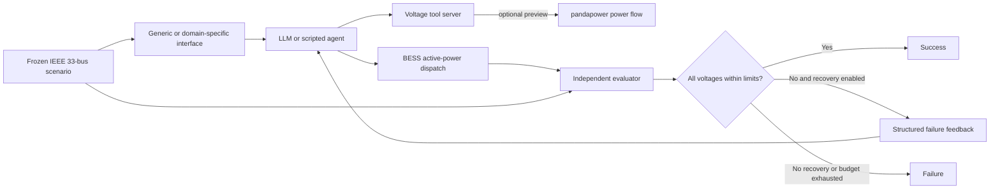

# Poweragent

面向配电网电压越限校正的 LLM Agent Benchmark。

本项目基于现有的 [PowerAgentBench](https://github.com/Power-Agent/PowerAgentBench)、[PowerMCP](https://github.com/Power-Agent/PowerMCP) 和 [PowerSkills](https://github.com/Power-Agent/PowerSkills) 进行最小侵入式扩展，研究以下问题：

> Domain-specific interface、verification 和 recovery 机制如何影响 LLM Agent 在配电网电压越限校正任务中的表现？

当前版本以 IEEE 33-bus 配电网为对象，允许 Agent 仅通过 BESS 有功功率调节消除欠电压或过电压，并由独立 pandapower evaluator 重新执行潮流、验证结果。

## 核心特点

- 复用 PowerAgentBench 的模型客户端、JSON tool-command 协议、runner 风格、scripted baseline、日志和 CSV/JSONL 输出机制。
- 使用 pandapower 构建和验证 IEEE 33-bus 配电网场景。
- 同时覆盖欠电压与过电压任务。
- 每个正式结果都从冻结的网络 JSON 重新加载并独立重放，不信任 Agent 自报结果。
- 支持 domain-specific interface、verification、recovery 三因素 `2×2×2` 全因子实验。
- 使用 SHA-256 固定 scenario、benchmark config 和 prompt，记录 solver 与 pandapower 版本。
- 不修改原有 N-1、N-2 和 RestoreBench 执行链。

## 系统流程



## 仓库结构

```text
power_agent/
├── PowerAgentBench/   主 benchmark、场景、Agent、evaluator 和运行脚本
├── PowerMCP/          电力软件与 MCP 工具层参考实现
├── PowerSkills/       电力领域 workflow 与 Agent interface 参考
├── agent.md           面向后续 Agent/开发者的完整项目交接文档
└── README.md          项目首页
```

三部分的职责边界：

| 模块 | 本项目中的用途 |
|---|---|
| PowerAgentBench | 主实验框架和所有新增 benchmark 代码 |
| PowerMCP | pandapower/电力工具语义参考；当前不直接依赖其全局 MCP server 状态 |
| PowerSkills | 电压治理、DER 和 pandapower workflow 的设计参考 |

## Benchmark 定义

当前第一阶段范围：

- 网络：`pandapower.networks.case33bw()`；
- 电压合格范围：`0.95–1.05 pu`；
- 场景：8 个冻结快照，其中 4 个欠电压、4 个过电压；
- BESS 位置：bus 8、17、24、32；
- 单台 BESS 有功范围：`[-1.5, 1.5] MW`；
- 动作步长：`0.25 MW`；
- 潮流算法：backward/forward sweep (`bfsw`)；
- 最大提交次数：3；
- 最大 preview 次数：4；
- 最大 LLM turns：12。

暂不考虑：

- 时序和多时段调度；
- SOC 与能量容量约束；
- 充放电效率；
- BESS 无功与 inverter capability curve；
- 电力电子暂态；
- 保护和动态稳定问题。

### BESS 符号约定

Agent、prompt、日志和结果文件统一使用：

- `p_mw > 0`：BESS 放电，向电网注入有功；
- `p_mw < 0`：BESS 充电，从电网吸收有功。

这与 pandapower `storage.p_mw` 的原始符号相反。符号转换只发生在 evaluator 的 pandapower 适配层。

## 实验设计

实验矩阵定义在 [`experiments.json`](PowerAgentBench/benchmarks/steady/voltage_control/config/experiments.json)：

| 因素 | 关闭 | 开启 |
|---|---|---|
| Domain-specific interface | 原始 bus voltage 数据 | 越限分类、关键极值和领域符号提示 |
| Verification | 不允许提交前 preview | 允许有限次数的候选 dispatch 潮流预演 |
| Recovery | 第一次 submit 后结束 | 接收独立失败反馈并重新规划 |

condition id 使用 `I0-V0-R0` 至 `I1-V1-R1`。

无论 Agent-visible verification 是否开启，最终 independent evaluator 始终执行。

## 快速开始

### 1. 安装环境

建议使用 Python 3.11 和 [uv](https://docs.astral.sh/uv/)。

```powershell
cd PowerAgentBench
uv venv --python 3.11 .venv
uv pip install --python .venv\Scripts\python.exe -e . pytest
```

项目将 pandas 限制为 `>=2,<3`，以避免当前 pandapower 版本与 pandas 3 的结果表写回兼容问题。

### 2. 构建并验证冻结场景

```powershell
.venv\Scripts\python.exe scripts\build_voltage_cases.py
```

构建器会：

1. 创建 IEEE 33-bus 欠压和过压快照；
2. 写入 public/full scenario artifacts；
3. 生成 SHA-256 manifest；
4. 搜索 private witness dispatch；
5. 使用 independent evaluator 重放 witness；
6. 拒绝没有真实越限或无法校正的场景。

### 3. 运行 scripted baselines

```powershell
.venv\Scripts\python.exe scripts\run_voltage_baselines.py
```

当前 baseline：

- `No-action`
- `Nearest-BESS-greedy`
- `Voltage-sensitivity-greedy`

### 4. 运行测试

```powershell
.venv\Scripts\python.exe -m pytest -q tests
```

代码检查：

```powershell
uvx ruff check poweragentbench scripts tests
```

## 运行 LLM Agent

### OpenAI

```powershell
$env:POWERAGENTBENCH_OPENAI_API_KEY="your-api-key"

.venv\Scripts\python.exe scripts\run_voltage_agent_eval.py `
  --provider openai `
  --model <model-id> `
  --domain-interface `
  --verification `
  --recovery `
  --repeats 3
```

### Ollama

```powershell
$env:POWERAGENTBENCH_OLLAMA_URL="http://localhost:11434/api/generate"

.venv\Scripts\python.exe scripts\run_voltage_agent_eval.py `
  --provider ollama `
  --model <local-model> `
  --domain-interface `
  --verification `
  --recovery
```

关闭实验因素：

```text
--no-domain-interface
--no-verification
--no-recovery
```

API key 和私有 endpoint 应放在环境变量或本地 `.env` 中，不要提交到仓库。

## Agent 工具接口

LLM 每轮返回一个 JSON command：

```json
{"tool": "<tool_name>", "args": {}}
```

可用工具：

- `case_summary`
- `inspect_voltage_state`
- `get_bess_capabilities`
- `preview_bess_dispatch`，仅 verification 开启时存在
- `submit`

提交示例：

```json
{
  "tool": "submit",
  "args": {
    "dispatch": [
      {"bess_id": "BESS_1", "p_mw": 0.25},
      {"bess_id": "BESS_2", "p_mw": -0.50}
    ]
  }
}
```

## Independent evaluator

正式评分链：

```text
scenario_id + submitted dispatch
    → 验证 manifest 与 benchmark config hash
    → 从 full/Vxxxx.json 重新加载网络
    → 验证 BESS id、功率边界、步长和数值合法性
    → 转换 benchmark/pandapower 功率符号
    → 重新运行锁定参数的 pandapower 潮流
    → 从 res_bus 独立检测全部电压越限
```

成功要求：

1. 潮流收敛；
2. 所有 bus 电压均位于 `[0.95, 1.05] pu`。

标准 `case33bw()` 不提供研究级线路热限值，因此 line loading 只记录为诊断指标，不进入成功判定。

## 输出文件

默认输出目录：

```text
PowerAgentBench/results/voltage_control/
```

LLM 实验输出：

```text
<prefix>_per_case.csv
<prefix>_summary.csv
<prefix>_tool_logs.jsonl
<prefix>_attempts.jsonl
<prefix>_api_debug.jsonl
<prefix>_errors.jsonl
```

结果记录包含：

- scenario、config 和 prompt hash；
- dataset、pandapower 和 solver 版本；
- model/provider/condition/repetition；
- 初始与最终电压越限；
- dispatch、动作成本和潮流调用次数；
- preview、recovery、invalid tool call 和 workflow 指标。

`results/` 默认不进入 Git。

## 当前验证结果

### 测试

```text
11 passed
ruff: All checks passed
```

8 个 private witnesses 均已通过独立重放验证。重复构建已确认 full scenario hashes 稳定。

### Scripted baselines

| Agent | Success rate | Mean action L1 |
|---|---:|---:|
| No-action | 0% | 0 MW |
| Nearest-BESS-greedy | 100% | 1.9375 MW |
| Voltage-sensitivity-greedy | 100% | 1.15625 MW |

旧 PowerAgentBench N-2 baseline 已完成兼容性 smoke test，原执行链仍可运行。

## 主要代码入口

| 文件 | 用途 |
|---|---|
| [`voltage_case.py`](PowerAgentBench/poweragentbench/voltage_case.py) | 场景构建、加载与 hash 校验 |
| [`voltage_tools.py`](PowerAgentBench/poweragentbench/voltage_tools.py) | Agent-facing tools 与实验开关 |
| [`voltage_agentic.py`](PowerAgentBench/poweragentbench/voltage_agentic.py) | LLM loop、baseline 和 metrics |
| [`voltage_evaluator.py`](PowerAgentBench/poweragentbench/voltage_evaluator.py) | 独立 pandapower 重放评分 |
| [`build_voltage_cases.py`](PowerAgentBench/scripts/build_voltage_cases.py) | corpus 构建与 witness 验证 |
| [`run_voltage_baselines.py`](PowerAgentBench/scripts/run_voltage_baselines.py) | scripted baseline runner |
| [`run_voltage_agent_eval.py`](PowerAgentBench/scripts/run_voltage_agent_eval.py) | OpenAI/Ollama Agent runner |

## 当前限制与后续工作

当前限制：

- corpus 只有 8 个确定性场景；
- 尚未完成真实模型的全量 `2×2×2` 实验；
- 每次 runner 调用只执行一个 condition；
- tool protocol 当前是复用 Level 2 的文本 JSON command，并非真实 MCP transport；
- 没有 SOC、时序、效率、无功和暂态模型；
- private witness 位于开放仓库，sealed evaluation 时必须隔离。

建议下一步：

1. 增加全因子 campaign/sweep runner；
2. 扩充并分层划分 scenario corpus；
3. 建立 sealed evaluation packaging；
4. 完成多模型、多 repetitions pilot；
5. 增加 factorial/interaction effect 与 bootstrap CI 分析；
6. benchmark 稳定后，再向 PowerMCP 增加 BESS 查询和设定工具；
7. 第二阶段再引入 SOC 和多时段任务。

## 文档

- [完整项目交接文档](agent.md)
- [Voltage benchmark 说明](PowerAgentBench/benchmarks/steady/voltage_control/README.md)
- [PowerAgentBench 原始文档](PowerAgentBench/README.md)
- [PowerMCP 文档](PowerMCP/README.md)
- [PowerSkills 文档](PowerSkills/README.md)

## GitHub

<https://github.com/yangzz1125/Poweragent>

## License 与来源

本工作区聚合了多个上游项目。代码、数据集和第三方 case 可能适用不同许可证与引用要求；重新分发或发表实验结果前，请分别查看各子项目中的 `LICENSE`、`NOTICE` 和 dataset license 文件，并保留原始项目的 attribution。
